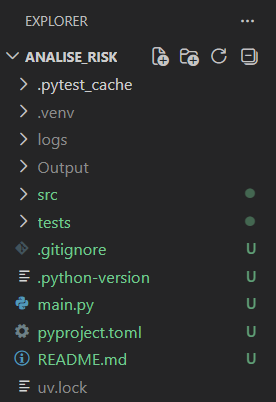
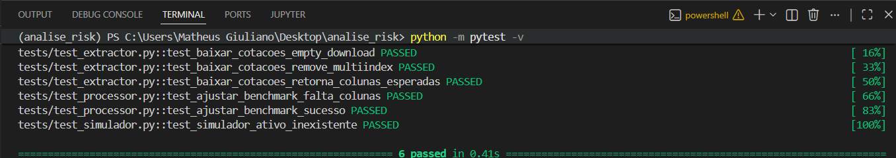
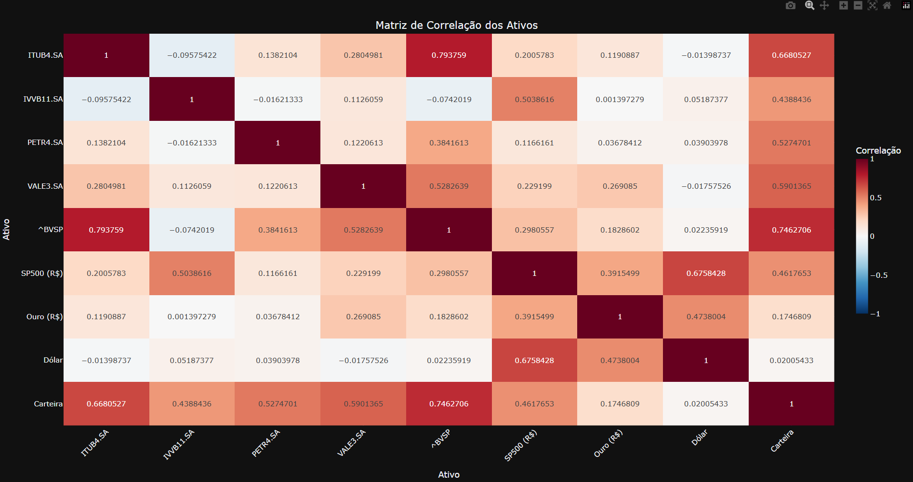
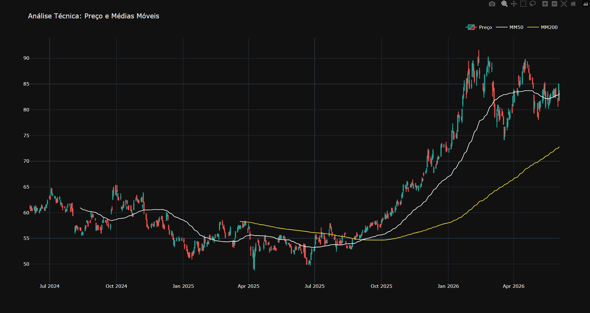
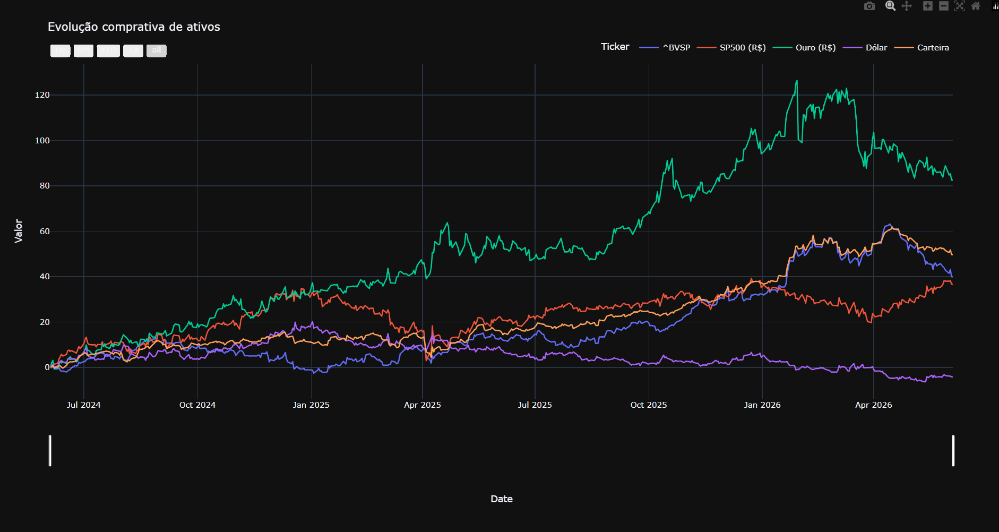

# Risk Analysis Portfolio

A Python-based financial risk analysis system designed to collect, process, simulate, and visualize investment portfolio performance using real market data.

This project integrates with the Yahoo Finance API to automatically retrieve historical asset prices, process benchmark data, simulate portfolio behavior, and generate interactive visualizations for investment analysis.

---

## Overview

The application follows a modular architecture that separates data extraction, processing, simulation, and visualization responsibilities.

Workflow:

```text
Yahoo Finance API
        │
        ▼
Data Extraction
        │
        ▼
Data Processing
        │
        ▼
Portfolio Simulation
        │
        ▼
Risk Analysis
        │
        ▼
Interactive Visualizations
```

---

## Features

- Real-time market data collection through Yahoo Finance API
- Historical asset price extraction
- Data cleaning and preprocessing
- Portfolio simulation
- Benchmark comparison
- Risk and performance analysis
- Interactive financial visualizations
- Structured logging
- Automated testing with Pytest
- Modular and scalable architecture

---

## Tech Stack

### Core

- Python 3.13
- Pandas
- NumPy

### Financial Data

- yFinance
- Yahoo Finance API

### Visualization

- Plotly

### Testing

- Pytest
- Pytest-Mock
- Coverage

### Logging

- Loguru

---

## Project Structure

```text
analise_risk/
├── src/                    
│   ├── data/
│   │   └── extractor.py    
│   ├── processing/
│   │   └── processor.py    
│   ├── simulation/
│   │   └── simulator.py    
│   ├── visuals/
│   │   └── visualizer.py   
│   └── config.py           
│
├── tests/                  
│   ├── conftest.py         
│   ├── test_extractor.py
│   ├── test_processor.py
│   └── test_simulator.py
│
├── images/                 
├── outputs/                
├── logs/                   
├── main.py                 
├── .gitignore              
├── pyproject.toml          
└── uv.lock                 
```

---

## Testing

The project includes automated unit tests covering critical business logic and error handling scenarios.

### Current Coverage

| Module | Coverage |
|----------|----------|
| Simulator | 74% |
| Processor | 71% |
| Extractor | 59% |

**Business Logic Coverage: 66%**

### Tested Scenarios

- API response validation
- Empty dataset handling
- DataFrame formatting
- MultiIndex normalization
- Benchmark processing
- Portfolio simulation validation
- Invalid asset detection
- Exception handling

---

## Screenshots

### Project Structure



### Automated Tests



### Correlation Performance



### Risk Analysis



### Benchmark Comparison



---

## Skills Demonstrated

This project showcases practical experience with:

- Python Development
- Object-Oriented Programming (OOP)
- API Integration
- Financial Data Analysis
- Data Processing Pipelines
- ETL Concepts
- Software Testing
- Data Visualization
- Logging and Monitoring
- Clean Code Principles
- Modular Software Architecture

---

## Why This Project Matters

Unlike tutorial-style projects, this application works with real financial market data obtained through an external API.

It demonstrates the complete lifecycle of a data-driven application:

- External API consumption
- Data extraction
- Data transformation
- Portfolio simulation
- Analytical processing
- Visualization
- Automated testing

These are common requirements in Python Developer, Automation, Data Analyst, and Financial Technology (FinTech) roles.

---

## Future Improvements

- Portfolio optimization algorithms
- Sharpe Ratio analysis
- Volatility metrics
- Value at Risk (VaR)
- Streamlit dashboard
- Database integration
- CI/CD with GitHub Actions
- Docker containerization

---

## Author

**Matheus Giuliano**

Python Developer | Automation | Data Analysis

GitHub: https://github.com/Kiiomaru

LinkedIn: https://www.linkedin.com/in/magiuliano/
